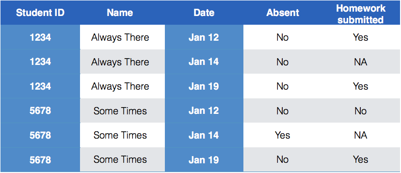

```{r setup, include=FALSE}
knitr::opts_chunk$set(echo = TRUE)
library(tidyverse)
```
# Dealing with Messy (3) and (4)

## Messy (3)

Messy (3): *Multiple observational units are stored in the same table.*

What does that mean? The *key is split*, i.e. for some values all key variables are necessary, while other values only need some key variables.



## Why do we need to take care of split keys?

- Data redundancy introduces potential problems (same student *should* have the same student ID)
- to check data consistency, we split data set into parts - this process is called *normalizing*
- normalization reduces overall data size
- useful way of thinking about objects under study


## Tidying Messy (3)

Splitting into separate datasets:


## Example: Box office gross

The-Numbers website publishes [weekly charts](http://www.the-numbers.com/weekend-box-office-chart) of the gross income of all movies playing across the US. A set of scraped data with movies for the last two years is available in the repo.

```{r echo = FALSE}
box <- read.csv("../data/boxoffice.csv")
head(box, 4)
```

What are the key variables? Why is the key split?

## First round of Data tidying

```{r}
box <- box %>% mutate(
  Gross = parse_number(Gross),
  Total.Gross = parse_number(Total.Gross),
  Days = parse_number(Days),
  Thtrs. = parse_number(Thtrs.)
) 
```

- All other variables are derived from these four variables, `Movie` name, and `Distributor`. 
- We should take re-calculate the derived variabes to check for consistency. 

## Taking care of the split key

```{r eval = FALSE}
# if we get an error with a message about the length of a dataset we know we have a problem
movie <- box %>% group_by(Movie) %>% summarize(
  Distributor = unique(Distributor) 
)
```

`Error: expecting a single value`

Bingo! but what now? 

```{r}
box %>% group_by(Movie) %>% summarize(
  Distributor = length(unique(Distributor))
) %>% arrange(desc(Distributor))
```

## Looking into inconsistencies

The movie *Girlhood* has two distributors: " "  and `Strand` - i.e. the first week the distributor is missing, let's fix that:

```{r}
box <- box %>% mutate(
  Distributor = replace(Distributor, Movie=="Girlhood", "Strand")
)
```

The movie `The Witness` is actually two different movies, one that came out in October 2015, another one that came out in June 2016. Movie name by itself is not a key. Let's derive the *release date* for each movie:

```{r}
box <- box %>% mutate(Release = lubridate::ymd(date)-Days)
```

## Splitting into separate datasets - Take 2

```{r}
movie <- box %>% group_by(Movie, Release) %>% summarize(
  Distributor = unique(Distributor) 
)
dim(movie)
length(unique(box$Movie))
```

Still not quite right - the number of days is a derived variable, and is not quite consistent. 

## 

```{r}
movie %>% group_by(Movie) %>% count() %>% arrange(desc(n))
movie %>% filter(Movie =="Hot Water")
```

## Different approach


##

```{r}
box %>% ggplot(aes(x = Days, y = Gross))  + 
  geom_line(aes(group = Movie), alpha = 0.1) + #scale_y_log10() +
  xlim(c(0, 100))
```


# Messy (4)
