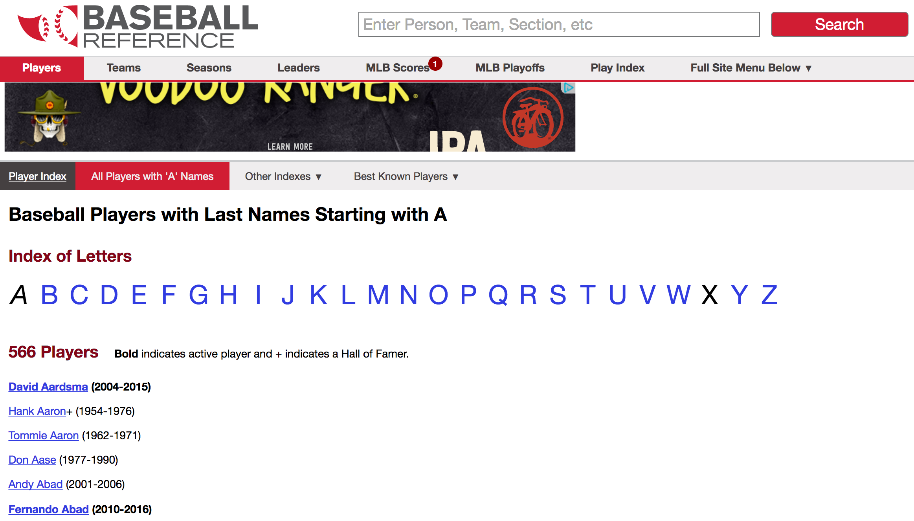

```{r setup, include=FALSE, message=FALSE, warning = FALSE}
knitr::opts_chunk$set(echo = TRUE)
library(tidyverse)
```

## Web Scraping 


## The `rvest` package

`read_html` gets *all* the information from a URL

```{r warning = FALSE, message = FALSE}
library(rvest)
url <- "http://www.nytimes.com/elections/results/iowa"
html <- read_html(url)
html
```

## Get a *table* from an online source

`html_table` extracts all tables from the sourced html into a list of data frames:

```{r}
tables <- html %>% html_table(fill=TRUE)
tables %>% purrr::map(glimpse)
```
##

Most tables need a bit of clean-up:

```{r}
ia_results <- tables[[2]] %>% mutate(
  Trump = parse_number(Trump),
  Clinton = parse_number(Clinton)
)
ia_results
```

## Your Turn (5 mins)

Connect to the website of the NY Times election results at http://www.nytimes.com/elections/results/

- Pick your favorite state (by clicking on the state on the map)
- Use `rvest` to download the election results for the 2016 Presidential Election for all counties of your state.
- Clean up the data (numbers should be numbers).
- Convert the numbers into row-wise percentages (decide on either %Republican or %Democrat).


## Your Turn (8 mins)

Can you get the data you just scraped onto a map of the counties? - Try to map the percentage you calculated to the fill-color of the counties' polygons.

You will need to `join` the percentages with the county polygons:

```{r message=FALSE}
counties <- map_data("county")
head(counties)
```

## Your Turn - Solution

```{r}
ia_results <- ia_results %>% mutate(
  PercDem = Clinton/(Trump + Clinton)*100,
  subregion = tolower(`Vote by county`)
) 

anti_join(ia_results, counties %>% filter(region=="iowa"), by="subregion")
anti_join(counties %>% filter(region=="iowa"), ia_results,  by="subregion")
```

## Your Turn - Solution (cont'd)

```{r}
ia_results <- ia_results %>% mutate(
  subregion = replace(subregion, subregion=="o'brien", "obrien")
) 

ia_full <- left_join(ia_results, 
                     counties %>% filter(region=="iowa"), 
                     by="subregion")
```

## Your Turn - Solution (cont'd)

```{r}
ia_full %>% 
  ggplot(aes( x = long, y = lat, group = subregion)) +
  geom_polygon(aes(fill = PercDem)) + 
  scale_fill_gradient2(midpoint=50, mid = "white") +
  ggthemes::theme_map()
```

## Beyond tables

Sometimes data on the web is not structured as nicely ... e.g. let's assume we want to get a list of all recently active baseball players from [Baseball reference](http://www.baseball-reference.com/players/)



## SelectorGadget

- SelectorGadget is a javascript bookmarklet to determine the css selectors of pieces of a website we want to extract.
- Bookmark the [SelectorGadget](javascript:(function(){var%20s=document.createElement('div');s.innerHTML='Loading...';s.style.color='black';s.style.padding='20px';s.style.position='fixed';s.style.zIndex='9999';s.style.fontSize='3.0em';s.style.border='2px%20solid%20black';s.style.right='40px';s.style.top='40px';s.setAttribute('class','selector_gadget_loading');s.style.background='white';document.body.appendChild(s);s=document.createElement('script');s.setAttribute('type','text/javascript');s.setAttribute('src','http://www.selectorgadget.com/stable/lib/selectorgadget.js?raw=true');document.body.appendChild(s);})();) link, then click on it to use it.
- When SelectorGadget is active, pieces of the website are highlighted in orange/green/red.
- Use SelectorGadget on http://www.baseball-reference.com/players/ .
- read more details on `vignette("selectorgadget")`

## SelectorGadget Result

```{r}
url <- "http://www.baseball-reference.com/players/a/"
html <- read_html(url)
html %>% html_nodes("b a") %>% html_text()
```

## Example, varied

We are, in fact, not just interested in the *names of the players*, but also in the *links* to each player's website

- `html_attr` let's us access an attribute of an html node
- `html_attrs` extracts all attributes of an html node

```{r}
html %>% html_nodes("b a") %>% html_attr(name="href")
```

## Your Turn

Use the [SelectorGadget](javascript:(function(){var%20s=document.createElement('div');s.innerHTML='Loading...';s.style.color='black';s.style.padding='20px';s.style.position='fixed';s.style.zIndex='9999';s.style.fontSize='3.0em';s.style.border='2px%20solid%20black';s.style.right='40px';s.style.top='40px';s.setAttribute('class','selector_gadget_loading');s.style.background='white';document.body.appendChild(s);s=document.createElement('script');s.setAttribute('type','text/javascript');s.setAttribute('src','http://www.selectorgadget.com/stable/lib/selectorgadget.js?raw=true');document.body.appendChild(s);})();) on the website for [David Aardsma](http://www.baseball-reference.com/players/a/aardsda01.shtml)

Find the css description to extract his career statistics and load them into your R session.

Does the same code work to extract career statistics for (some of) the other players?

What other information do we need to know? - and how can we get to that?

## Your Turn  - Solution

```{r}
url <- "http://www.baseball-reference.com/players/a/aardsda01.shtml"
html <- read_html(url)
html %>% html_nodes(".stats_pullout .poptip") %>% html_text()
html %>% html_nodes(".stats_pullout .p1 p, .stats_pullout .p2 p, .stats_pullout .p3 p") %>% html_text()
```

## Your Turn  - Solution (cont'd)

Now apply to other players (with 'a' as starting letter) - first we get everything tidied up in a dataset

```{r}
url <- "http://www.baseball-reference.com/players/a/"
html <- read_html(url)
players <- html %>% html_nodes("b a") %>% html_text()
links <- html %>% html_nodes("b a") %>% html_attr(name="href")

bb <- data.frame(players=players, links = links)
```


## Your Turn  - Solution (cont'd)

second, we follow the links to get to career statistics:

```{r}
getStats <- function(link) {
  s <- html_session("http://www.baseball-reference.com")
  s <- s %>% jump_to(link)
  html <- read_html(s)
  type <- html %>% html_nodes(".stats_pullout .poptip") %>% html_text() 
  values <- html %>% html_nodes(".stats_pullout .p1 p, .stats_pullout .p2 p, .stats_pullout .p3 p") %>% html_text()
  what <- html %>% html_nodes(".stats_pullout strong") %>% html_text()
  df <- data.frame(type=rep(type, each=length(what)), values=values, what = rep(what, length(values)))
  df
}

bbhead <- bb[1:5,] %>% mutate(
  career = links %>% purrr::map(getStats)
) 
bbhead[,c("players", "career")]
```

## Your Turn  - Solution (cont'd)

We also need to know the position a player has ...

This information has the css path "#meta p:nth-child(2)"
