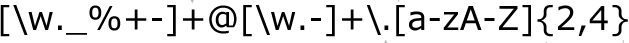

```{r setup, include=FALSE, message=FALSE, warning = FALSE}
knitr::opts_chunk$set(echo = TRUE)
library(tidyverse)
```

## Regular Expressions 



## [xkcd #208](https://xkcd.com/208/)


## Lessons learned from web-scraping

*Solutions using small steps are better than scraping everything in one go*

**Example:** scrape list of Statistics classes offered next semester:

```{r warning = FALSE, message= FALSE}
library(rvest)
url <- "http://catalog.iastate.edu/azcourses/stat/"
html <- read_html(url)

# Results: we get some, but they don't look great
html %>% html_nodes(".courseblocklink strong, .noindent, .prereq")
```


## Lessons learned from web-scraping (cont'd)

```{r}
# much better, but the "data" itself isn't very tractable yet
courses <- html %>% html_nodes(".courseblocklink") %>% html_text()
credits <- html %>% html_nodes(".noindent") %>% html_text()
description <- html %>% html_nodes(".prereq") %>% html_text()

courses %>% glimpse()
credits %>% glimpse()
description %>% glimpse()
```

## Regular Expressions

- Regular expressions (regex, regexp) is a sequence of characters that form a search pattern
- Originated in 1950s. American mathematician Stephen Kleene formalized the description of a regular language.
-  Common usage with Unix text processing utilities ed, an editor, and grep (global regular expression print), a filter.
- R language provides this capability through ```grep```, ```gsub```, ...

## Example: Stat Courses

How many courses offer computing?

```{r}
grep("computing", description)
description[34]
```

## Example

We don't care about the casing, we also do not want to distinguish between `computing`, `computer`, and `computational`. 

```{r}
grep("[cC]omput", description)
indx <- grep("[cC]omput", description)
courses[indx]
```

## Basics of regular expressions

| expression          | meaning          |
----------------------------|:---------------------------- |
| ordinary characters | match themselves |
|  ```$ ^ { [ ( ) ] } * + ? \```      |   special characters    |
| ```[abc]``` | matches single letter from "a", "b", or "c" |
| ```[^abc]``` | matches any single letter other than "a", "b", and "c" |
| ```[a-gm]``` | matches any single letter out of "a", "b", ... "g" or "m" |
| ```[a-z][0-9]```   | matches one lower case letter followed by a digit|

## Basics of regular expressions (cont'd)

| expression          | meaning          |
----------------------------|:---------------------------- |
| `\x` | match a hexadecimal number |
| `\s` | whitespace |
| ^ | starting position within the string |
| $ | ending position with in the string |
| `< >` | start, end of a word |
| `\t \r \v \n` | tab, carriage return, vertical tab, new line |

## Multipliers

- ```?``` indicates there is **zero or one** of the preceding element, eg ```colou?r``` matches "color" or "colour"
- ```* ``` indicates there is **zero or more** of the preceding element, eg ```ab*c``` matches "ac", "abc", "abbc", "abbbc", ...
- ```+``` indicates there is **one or more** of the preceding element, eg ```ab+c``` matches "abc", "abbc", "abbbc", ...
- ```.``` matches any **single** character, eg ```a.c``` matches "abc" or "atc"

## Advanced Patterns

see `?regex`

* `[:alpha:]` Any alphabetic character
* `[:lower:]` Any lowercase character
* `[:upper:]` Any uppercase character
* `[:digit:]` Any digit
* `[:alnum:]` Any alphanumeric character (alphabetic or digit)
* `[:blank:]` Any white space character (space, tab, vertical tab)
* `[:graph:]` Any printable character, except space
* `[:print:]` Any printable character, including the space
* `[:punct:]` Any punctuation (i.e., a printable character that is not white space or alphanumeric)
* `[:cntrl:]` Any nonprintable character

## Examples

What do these regular expressions do?

`.at`

`[hc]at`

`[^t]at`

`[^hc]at`

`^[S]tat`

`[S]tat$`


## Trickier Examples

What do these regular expressions do?

`^s.*`

`[A-Z]\{3,\}`

`\[.\]`

`[bB]ar ?[cC]hart`

`^[0-9]{5}$`

`^(\d{3}-\d{3}-\d{4})*$`

`(\w[-._\w]*\w@\w[-._\w]*\w\.\w{2,3})`


## Your Turn (5 min)

- write out the regular expression for a number in scientific notation
<!--
```
grep("[+-]?([0-9]+\\.)?[0-9]+[eE][+-]?[0-9]+", c("1e-4", "-2.13e-1", "2E4"))
```
-->
- how can we try out whether the pattern works?


## Regular expressions in R

Patterns & Matches

* Find pattern: <code>grep, regexpr, gregexpr</code>
* Pattern replacement: <code>gsub (pattern, replacement, x)</code>

```
grep(pattern, x, ignore.case = FALSE, perl = FALSE, value = FALSE,
     fixed = FALSE, useBytes = FALSE, invert = FALSE)

gsub(pattern, replacement, x, ignore.case = FALSE, perl = FALSE,
     fixed = FALSE, useBytes = FALSE)
```

## Your Turn (8 min)

- Use a regular expression to delete any line breaks `\n` from the scraped credits section of the Stats courses. Save the result in vector `credits_clean`
- Introduce three logical vectors `Fall`, `Spring` and `Summer` that are true for a course that is offered in the Fall, Spring and/or Summer semester. Bonus: can you include information on alternate falls as well?


## Your Turn - Solution

```{r}
credits_clean <- gsub("\n", "", credits)

fall <- rep(FALSE, length(credits))
fall[grep(".* F\\..*", credits)] <- TRUE

spring <- rep(FALSE, length(credits))
spring[grep(".*[ \\.]S\\..*", credits)] <- TRUE

summer <- rep(FALSE, length(credits))
summer[grep(".*[ \\.]SS\\..*", credits)] <- TRUE

```

## Extracting pieces from a regular expression

- parentheses `( )` group a pattern of interest together
- using `\\1`, `\\2`, `\\3`, ... we can extract the first, second, third ... pattern

Imagine, we want to extract the number of credits for each course

```{r}
credits[1:5]
```

We use the expression `Cr. ` as cue; the number after that is the number of credits:
```{r}
gsub(".*Cr\\. ([0-9]|R|(arr)).*", "\\1", credits)
```

## Your Turn (5 min)

- Extract the course number from the scraped vector `courses`. 
- Overachiever: extract the number of lectures and lab time from the vector `credits`
