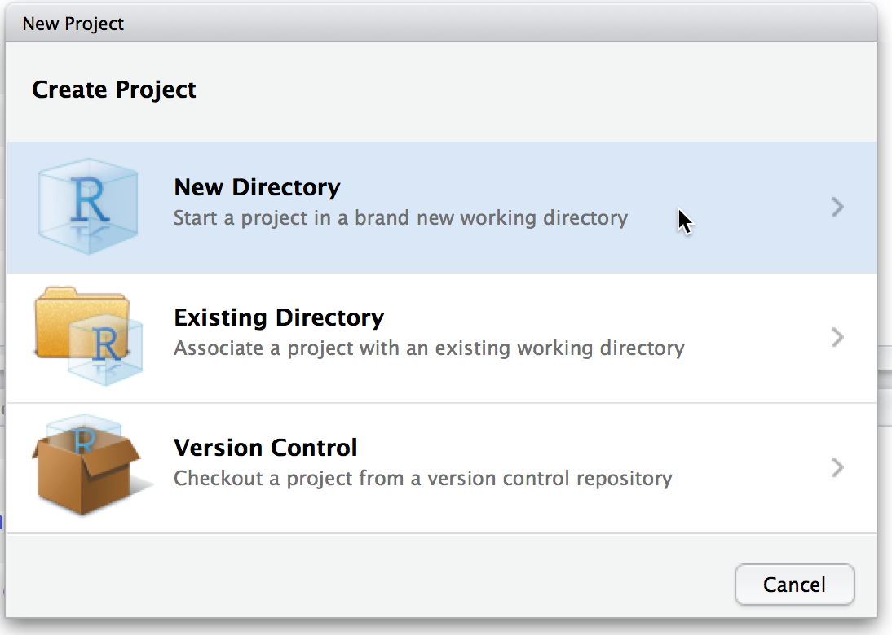
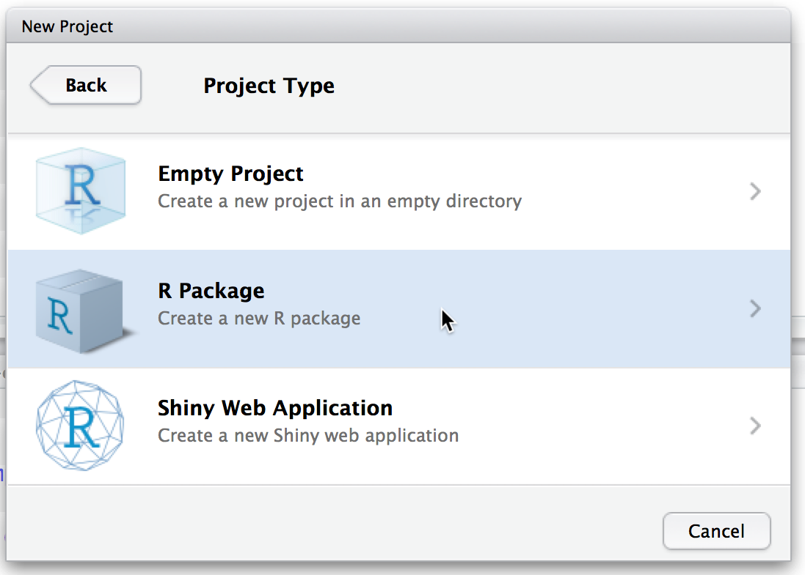
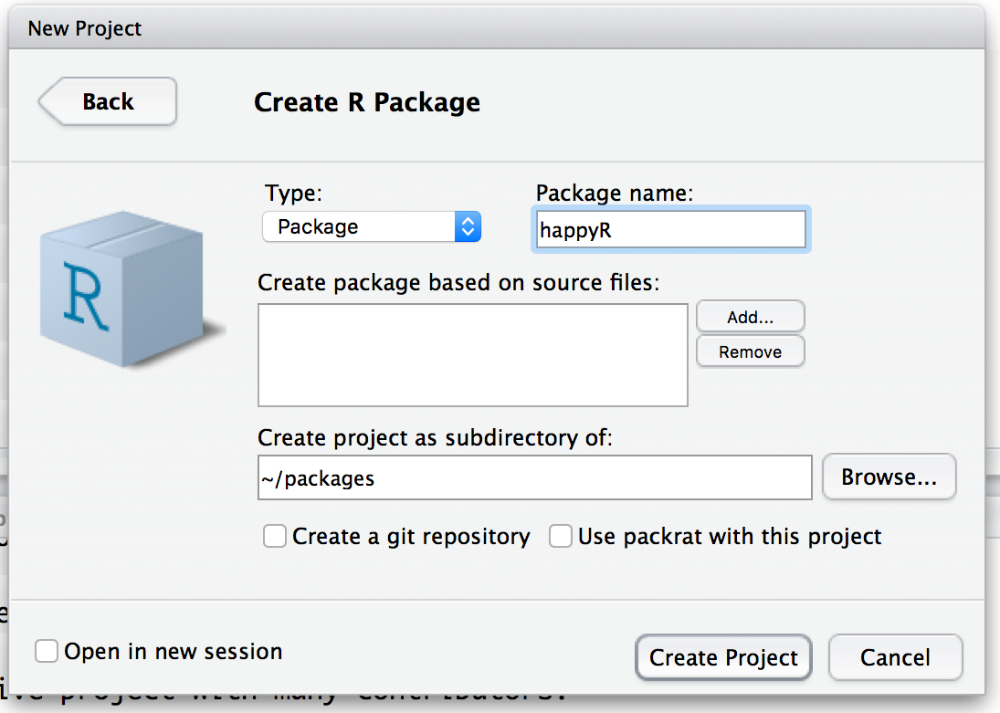
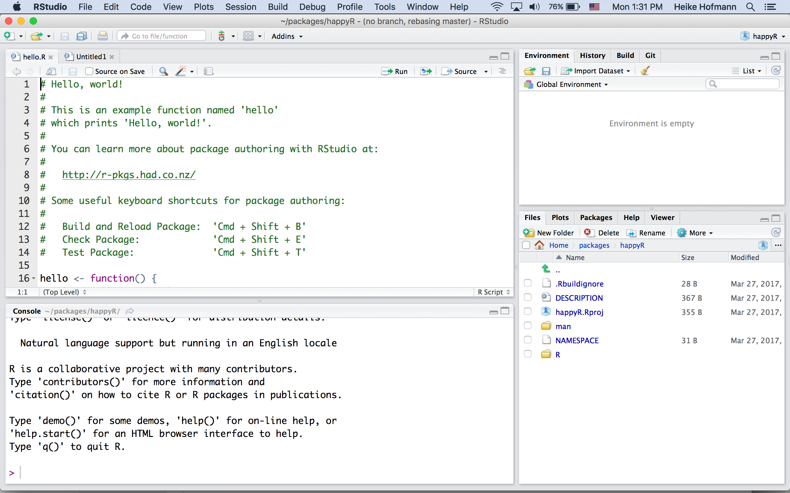

```{r setup, include=FALSE, message=FALSE, warning = FALSE}
knitr::opts_chunk$set(echo = TRUE)
library(tidyverse)
```

# R packages

## Outline

- file structures of packages
- documentation
- data in packages

<br>

Resource: [R packages](http://r-pkgs.had.co.nz/) by Hadley Wickham

## RStudio and R packages

RStudio supports creating new packages. Follow the dialogs through `New Project ...`



## RStudio and R packages (cont'd)

RStudio supports creating new packages. Follow the dialogs through `New Project ...`




## RStudio and R packages (cont'd)

RStudio supports creating new packages. Follow the dialogs through `New Project ...`



## {.white}



## File structure

Within folder that has the same name as your R package:

- DESCRIPTION
- NAMESPACE
- R
- man
- data

R code files go into the folder `R`, data sets go into the folder `data`, Rd files contain documentation and go into `man`


## DESCRIPTION

plain text file with all the meta information on a package

```
Package: happyR
Type: Package
Title: What the Package Does (Title Case)
Version: 0.1.0
Author: Who wrote it
Maintainer: The package maintainer <yourself@somewhere.net>
Description: More about what it does (maybe more than one line)
    Use four spaces when indenting paragraphs within the Description.
License: What license is it under?
Encoding: UTF-8
LazyData: true
```

## Licenses

- There's a (surprising?) range of common use licenses available: http://www.r-project.org/Licenses/
- More licenses at http://creativecommons.org/choose/ and  http://www.opensource.org/licenses/category
- Most often used: GPL-2, GPL-3, MIT
- GPL-2/3: "run, copy, distribute, study, change and improve the software" now and in the future, i.e. preserve open-source nature
- GPL-3 clears up some inconsistencies and ambiguities in GPL-2 and should be used in new projects
- MIT releases software completely and also allows use in commercial projects, removes liability of provider.


## Documentation

hello.Rd:

```
\name{hello}
\alias{hello}
\title{Hello, World!}
\usage{
hello()
}
\description{
Prints 'Hello, world!'.
}
\examples{
hello()
}
```

The Rd files are clearly structured, yet, we DO NOT want to write these ourselves (way too many places to mess up)


## The documentation workflow

1. Add roxygen comments to your .R files.
2. Run `devtools::document()` (or press `Ctrl/Cmd + Shift + D` in RStudio) to convert roxygen comments to .Rd files. 
3. Preview documentation with `?`.
4. Rinse and repeat until the documentation looks the way you want.

## Roxygen2

Roxygen comments start with `#'` to distinguish them from regular comments:

```
#' Add together two numbers.
#' 
#' @param x A number.
#' @param y A number.
#' @export
#' @return The sum of \code{x} and \code{y}.
#' @examples
#' add(1, 1)
#' add(10, 1)
add <- function(x, y) {
  x + y
}
```
`@export` does not write anything into the help file - instead it writes a line into `NAMESPACE` and makes the function visible to package users.

## Roxygenized example in `add.Rd`

```
% Generated by roxygen2 (4.0.0): do not edit by hand
\name{add}
\alias{add}
\title{Add together two numbers}
\usage{
add(x, y)
}
\arguments{
  \item{x}{A number}

  \item{y}{A number}
}
\value{
The sum of \code{x} and \code{y}
}
\description{
Add together two numbers
}
\examples{
add(1, 1)
add(10, 1)
}
```

## Your Turn (12 mins)

- Create a new R package using the RStudio dialog to set it up in a new project.
- Build the package (CMD + shift + B) and run the function `hello()`
- Have a look at `?hello`
- Delete the file `hello.Rd` in the folder `man`
- Include roxygen comments for the function `hello()` in the file `hello.R` to create the same help for `hello` as was there before.
- Run `devtools::document()` to create the file `hello.Rd`. 
- Build the package and run `?hello`.
- Already done? Expand the functionality of `hello` to produce an output of `Hello, string!` for `hello(string)`. Update `?hello` accordingly.

## Roxygen tags

| Tag      | Purpose           |
| ------ |:------------------------------------------------------------------- |
| `@param` |	Describe inputs |
| `@examples` |	Show how the function works |
| `@author`	| "Who wrote the function (if different from package)"|
| `@seealso` |	Pointers to related functions |
| `@return` |	Describe outputs |
| `@aliases` |	Make it easier for users to find |
| `@rdname`	| Useful for functions that are invalid filenames and for combining docs |

## Commands in Roxygen

| Tag      | Purpose           
| ------ |:------------------------------------------------------------------- |
| `\code{}` |	Discuss R code 
| `\link{}` | 	Make link to another function.  Usually wrapped in `\code{}`
|`\eqn{}` |	Inline equation (standard latex)
| `\emph{}` |	Italic text
| `\strong{}` |	Bold text

Numbered list (Use `\itemize{}` for bulleted):

```
\enumerate{
  \item First item
}
```


## Data in a package

- Data frames must be stored in the `data` folder using the command `save`. 
- Data documentation: http://r-pkgs.had.co.nz/data.html#documenting-data

```
#' Prices of 50,000 round cut diamonds.
#'
#' A dataset containing the prices and other attributes of almost 54,000
#' diamonds.
#'
#' @format A data frame with 53940 rows and 10 variables:
#' \describe{
#'   \item{price}{price, in US dollars}
#'   \item{carat}{weight of the diamond, in carats}
#'   ...
#' }
#' @source \url{http://www.diamondse.info/}
"diamonds"
```
